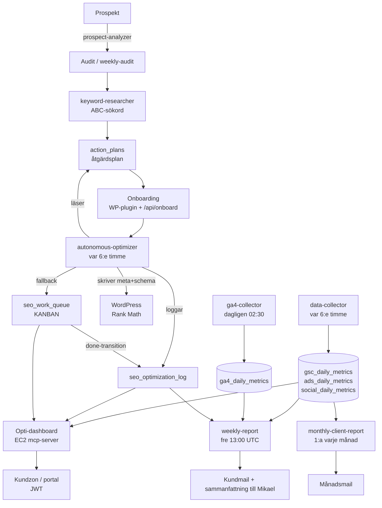

# 00 — Systemöversikt

> Verifierad mot live 2026-05-30 (AWS-profil `mikael`, eu-north-1, konto 176823989073, BQ-projekt `seo-aouto`). Inga gissningar — varje påstående är korsat mot `aws lambda list-functions`, EventBridge-rules, `aws ssm get-parameters-by-path` och BQ `INFORMATION_SCHEMA`.

## Vad SearchBoost är

En semi-autonom SEO/marknadsföringsbyrå. Kärnan är en pipeline som tar en kund från prospekt till löpande automatisk optimering + rapportering, driven av Claude-modeller via OpenRouter, med all data i BigQuery och all config i SSM Parameter Store.

## Dataflöde (översikt)

## Kärnkomponenter

| Lager | Var | Roll |
|-------|-----|------|
| Optimeringsmotor | `lambda-functions/autonomous-optimizer.js` (2266 rader) + 33 andra Lambdas | Läser åtgärdsplan/kanban, kör modell-routad optimering, skriver meta+schema till WP, loggar |
| EC2-server | `mcp-server-code/index.js` (7089 rader, monolit) | API, Opti-dashboard, kundportal (JWT), presentationer |
| MCP-servrar | `.mcp.json` | web-to-mcp, perispa (WP), sequential-thinking. **Ingen ads/social-MCP** — de körs som Lambdas |
| Data | BigQuery `seo-aouto.seo_data` (45 tabeller) | All metrics, kanban, loggar, kundregister |
| Config/secrets | SSM `/seo-mcp/*` (~200 params) | Per-kund integrationer, WP-creds, API-nycklar, tokens |
| WP-stack | `perispa/`, `wordpress-plugin/searchboost-onboarding/` | Rank Math + Perispa MCP |
| Headless-stack | `searchboost-react` (Next 16, React 19) | searchboost.se lab-sajt + framtida kundsajter |
| Minne | MemPalace wing `searchboost` (34 drawers) + `memory/*.md` | On-demand-kunskapsbas |

## Spindeln i nätet — kanban

`seo_work_queue` ÄR avsedd att vara källan för ALLA åtgärder (auto + manuell + framtida). `seo_optimization_log` ska följa från en done-transition, aldrig direkt-skrivas. Se [04-kanban-och-loggning.md](04-kanban-och-loggning.md) för nuläge vs börläge (idag läser optimizern primärt `action_plans`, inte kanban — det är ett identifierat gap).

## Filindex

| Fil | Innehåll |
|-----|----------|
| [01-infrastruktur.md](01-infrastruktur.md) | 34 Lambdas, EventBridge-crons, 45 BQ-tabeller, SSM-träd |
| [02-optimizer.md](02-optimizer.md) | Optimizern: GÖR vs BORDE GÖRA |
| [03-data-pipeline.md](03-data-pipeline.md) | data-collector + ga4-collector |
| [04-kanban-och-loggning.md](04-kanban-och-loggning.md) | seo_work_queue + loggning |
| [05-rapporter.md](05-rapporter.md) | Vecko- + månadsmail |
| [06-onboarding-keywords-atgardsplan.md](06-onboarding-keywords-atgardsplan.md) | Onboarding, ABC-sökord, åtgärdsplaner |
| [07-produktfeeds.md](07-produktfeeds.md) | Feeds, adaptive-merchandiser |
| [08-content-blueprint.md](08-content-blueprint.md) | content-blueprint-generator |
| [09-ads-och-social.md](09-ads-och-social.md) | google-ads-optimizer, social |
| [10-dashboards.md](10-dashboards.md) | Opti-dashboard + portal |
| [11-wordpress-build.md](11-wordpress-build.md) | Rank Math + Perispa best practice |
| [12-headless-webbygge.md](12-headless-webbygge.md) | Next.js anti-slop-standard |
| [13-kvalitet-och-codereview.md](13-kvalitet-och-codereview.md) | OpenRouter review-pipeline + repos |
| [14-sakerhet-och-ssm.md](14-sakerhet-och-ssm.md) | Secret-hygien + SSM-schema |
| [15-roadmap-fullservice.md](15-roadmap-fullservice.md) | Vägen till full-service |
