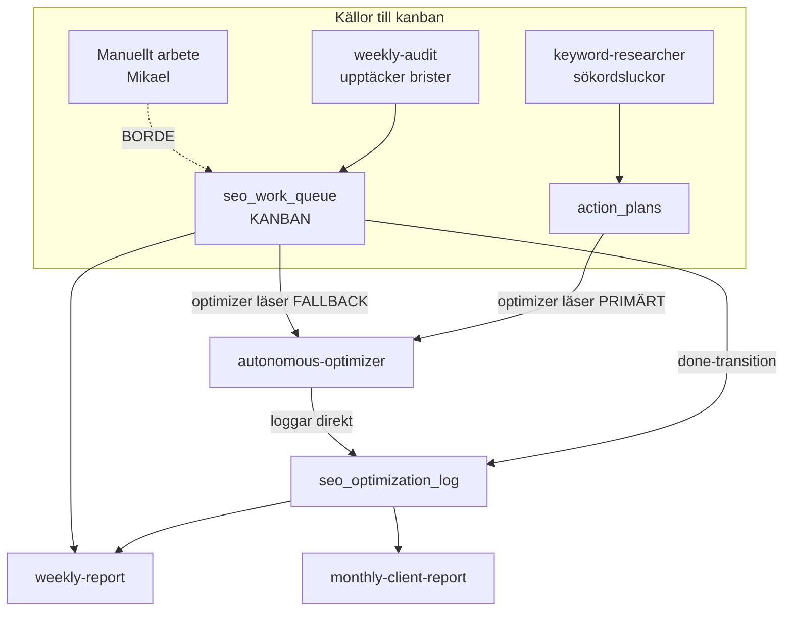

# 04 — Kanban & loggning

> `seo_work_queue` = spindeln i nätet. `seo_optimization_log` = facit. Verifierat 2026-05-30.

## Arkitekturbeslutet

ALLT som görs på en kund (auto + manuellt + framtida) ska gå genom kanban (`seo_work_queue`). Loggen (`seo_optimization_log`) ska följa från en done-transition — **aldrig direkt-skrivas**. Veckomail-incidenten 2026-05-15 (528 tysta fel) visade varför: hade allt gått via kanban hade felen synts direkt.

## Nuläge vs börläge

| Aspekt | NULÄGE (GÖR) | BÖRLÄGE (BORDE) |
|--------|--------------|------------------|
| Optimizerns källa | Läser `action_plans` primärt, `seo_work_queue` fallback | `seo_work_queue` som enda primärkälla |
| Logg-skrivning | Optimizern skriver **direkt** till `seo_optimization_log` (rad 1723) | Logg ska följa från done-transition i kanban |
| Manuellt arbete | Hamnar i Trello (avvecklat) / per-kund task-filer / dashboard | Loggas i `seo_work_queue` så det syns i veckomail |
| weekly-audit | ✅ Fyller `seo_work_queue` korrekt | — |
| SAFE_MODE-flaggat content | `flagForManualReview` → `headless_pending_fixes`? | Ska bli kanban-jobb som stängs via done |

## Tabeller i loggnings-loopen

| Tabell | Roll |
|--------|------|
| `seo_work_queue` | Kanban — alla jobb, status |
| `action_plans` | Optimizerns nuvarande primärkälla (månads-plan per kund) |
| `seo_optimization_log` | Facit över utförda optimeringar |
| `schema_optimization_log` | Schema-specifik logg |
| `headless_pending_fixes` | Flaggade fixar (Next.js-kunder) |
| `prompt_ab_log` | A/B-test av prompts |
| `performance_log` | Körningsmetrik |

## Gaps & åtgärder (separat pass)

1. **Flytta optimizerns primärkälla** action_plans → seo_work_queue.
2. **Inför done-transition-loggning**: optimizern uppdaterar kanban-status, en trigger/funktion skriver loggen — inte två separata direkt-skrivningar.
3. **Enforce manuellt arbete i kanban**: ersätt Trello/task-filer med kanban-poster så veckomailet fångar allt.
4. **Synlighet**: bygg en kanban-vy i Opti-dashboard (se [10](10-dashboards.md)) som visar pending/in-progress/done per kund.
