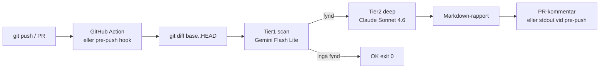
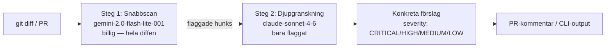

# 13 — Kvalitet & code review

> Repo-research verifierad 2026-05-30. Fas 2 (klonade referensrepos) genomförd 2026-05-31. Beslut: OpenRouter-pipeline, ingen ny prenumeration (Cursor avböjt).

## Klonat till `tools/vendor/` 2026-05-31

| Repo | Roll | Licens | Stjärnor |
|------|------|--------|----------|
| `aider` | Pair-programmer m. repo-map + git-diff | Apache-2.0 | 45 557 |
| `plandex` | Multi-step task agent m. diff-review | MIT | 15 422 |
| `anthropic-cookbook` | Pattern-katalog för agentic + tool-use | MIT | aktuell |
| `auto-code-rover` | Autonom buggrepair m. spectrum analysis | Apache-2.0 | 3 079 |

Alla `--depth 1` (shallow). Används som **referensimplementationer** vi lyfter ut algoritmer från — inte som körande tjänster.

`qodo-ai/pr-agent` (förstahandsval i kandidatlistan nedan) klonas separat när vi vill ha out-of-the-box GitHub Action.

## Vår review-pipeline (design — implementeras i nästa pass)

Konkret skript-skiss + per-språk-prompts byggs i `tools/code-review.sh` (separat pass).

## Mål

Andra-LLM-granskning av all kod via OpenRouter (billiga modeller), körd på diff/PR, som ger konkreta förbättringsförslag. Ingen ny månadskostnad utöver OpenRouter-tokens.

## Code review — kandidater

| Repo | Stars | Licens | Kommentar |
|------|-------|--------|-----------|
| **qodo-ai/pr-agent** | 11 412 | Apache-2.0 | **Förstahandsval.** Original öppen PR-reviewer. Stödjer godtycklig LLM-endpoint (LiteLLM under huven → OpenRouter funkar). CLI + GitHub Action. Aktivt underhållen. |
| kodustech/kodus-ai | ~1 142 | other | "Full control over model choice and costs" — passar OpenRouter-tänket, men tyngre self-host. |
| vercel-labs/openreview | ~1 411 | (saknas) | Self-hosted review-bot, Vercel-centrerad. Sekundärt. |
| truongnh1992/gemini-ai-code-reviewer | 240 | mit | Enkel GitHub Action mot Gemini — bra mönsterreferens för en lättviktig egen action. |
| sourcery-ai/sourcery | 1 818 | mit | Mer Python-refaktorering än LLM-review mot egen endpoint. |

**Rekommendation:** `qodo-ai/pr-agent` som motor. Den abstraherar modell via LiteLLM → peka mot OpenRouter. Kör som CLI på diff lokalt + valfri GitHub Action.

## Agentic-arkitektur — referensramar

Inte för att ersätta nuvarande Lambda-design, utan som mönsterkälla för framtida multi-agent-orkestrering (full-service, [15](15-roadmap-fullservice.md)).

| Repo | Stars | Licens | Roll |
|------|-------|--------|------|
| **crewAIInc/crewAI** | 52 474 | MIT | Role-playing autonoma agenter. Bra mönster för "byrå-team" (SEO-agent, ads-agent, content-agent). |
| **langchain-ai/langgraph** | 33 379 | MIT | Resilient agent-grafer/state machines. Bäst när flöden har förgrening + retry (passar pipelinen). |
| microsoft/autogen | 58 543 | CC-BY-4.0 | Konversationella multi-agent-mönster. CC-BY-licens → granska för kommersiell användning. |
| openai/swarm | 21 550 | MIT | Lättvikts-orkestrering, pedagogiskt. Bra för enkla handoffs. |
| ComposioHQ/agent-orchestrator | 7 332 | MIT | Parallella kodnings-agenter (plan → spawn → merge). |

**Rekommendation:** studera **crewAI** (team-metafor) + **langgraph** (robust flöde) som mönster. Klona till `tools/vendor/` för referens — bygg inte om hela systemet, plocka idéer (roller, state, retry, handoff).

## OpenRouter review-pipeline — design

- **Steg 1 (billig, bred):** Gemini Flash Lite läser hela diffen, flaggar misstänkta hunks (säkerhet, buggar, stilbrott). Återanvänder samma modell-tier som optimizern (tier1).
- **Steg 2 (dyr, smal):** Sonnet 4.6 djupgranskar endast flaggade delar → konkreta fixförslag.
- **Severity** enligt ECC code-review-regeln (CRITICAL blockerar, HIGH varnar).
- **Kostnadskontroll:** två-stegs gör att Sonnet bara körs på en bråkdel av koden. Logga token-kostnad i `cost_*`-tabellerna (cost-tracker finns redan).

### Integration
- API-nyckel finns redan: SSM `/seo-mcp/openrouter/api-key`. (`/seo-mcp/cursor/api-key` kan avvecklas — Cursor avböjt.)
- Kör som: (a) lokal CLI-hook på `git diff` före commit, och/eller (b) GitHub Action på PR mot `main`.
- pr-agent konfigureras med `config.model` → OpenRouter-modellsträng + `OPENAI_API_BASE=https://openrouter.ai/api/v1`.

## Åtgärdslista
- [ ] Mikael godkänner repo-val (pr-agent + crewAI/langgraph som referens)
- [ ] Klona valda till `tools/vendor/` (licens noteras)
- [ ] Konfigurera pr-agent mot OpenRouter (two-tier)
- [ ] Wire som lokal pre-commit + GitHub Action
- [ ] Logga review-kostnad i cost-tabellerna
