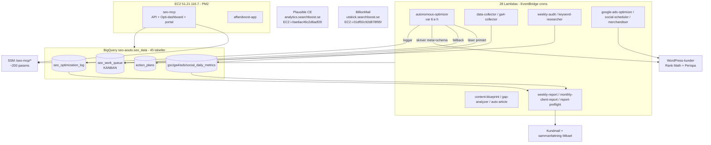
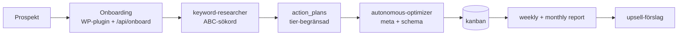

# SearchBoost — Arkitektur & kunskapsbas

> Komplett kartläggning av SearchBoost-systemet. Verifierad live mot AWS, BigQuery och SSM **2026-05-30** (profil `mikael`, eu-north-1, BQ `seo-aouto`). Inga gissningar — varje påstående är korsat mot live-state.

Detta är master-indexet. Varje delfil har en **GÖR vs BORDE GÖRA**-sektion som skiljer på vad systemet faktiskt gör idag och vad det borde göra.

## Snabbnavigering

| # | Fil | Vad du hittar här |
|---|-----|-------------------|
| 00 | [00-oversikt.md](00-oversikt.md) | Systemkarta + dataflöde |
| 01 | [01-infrastruktur.md](01-infrastruktur.md) | 28 Lambdas, 28 crons, 45 BQ-tabeller, SSM-träd, EC2 |
| 02 | [02-optimizer.md](02-optimizer.md) | Optimizern: SAFE_MODE, modell-routing, vad den skriver |
| 03 | [03-data-pipeline.md](03-data-pipeline.md) | GSC/Ads/GA4-insamling |
| 04 | [04-kanban-och-loggning.md](04-kanban-och-loggning.md) | seo_work_queue som spindel + loggning |
| 05 | [05-rapporter.md](05-rapporter.md) | Vecko- + månadsmail |
| 06 | [06-onboarding-keywords-atgardsplan.md](06-onboarding-keywords-atgardsplan.md) | Onboarding, ABC-sökord, åtgärdsplaner |
| 07 | [07-produktfeeds.md](07-produktfeeds.md) | Merchandising + feeds |
| 08 | [08-content-blueprint.md](08-content-blueprint.md) | Content-plan |
| 09 | [09-ads-och-social.md](09-ads-och-social.md) | Google Ads + social (ingen MCP — bara Lambdas) |
| 10 | [10-dashboards.md](10-dashboards.md) | Opti-dashboard + kundportal + TIER_LIMITS |
| 11 | [11-wordpress-build.md](11-wordpress-build.md) | Rank Math + Perispa |
| 12 | [12-headless-webbygge.md](12-headless-webbygge.md) | Next.js anti-slop-standard |
| 13 | [13-kvalitet-och-codereview.md](13-kvalitet-och-codereview.md) | OpenRouter review-pipeline + repos |
| 14 | [14-sakerhet-och-ssm.md](14-sakerhet-och-ssm.md) | Secret-hygien + SSM-schema |
| 15 | [15-roadmap-fullservice.md](15-roadmap-fullservice.md) | Vägen till full-service + prioriterade fixar |
| 16 | [16-plausible.md](16-plausible.md) | Plausible self-hosted analytics (analytics.searchboost.se) |
| 17 | [17-billionmail.md](17-billionmail.md) | BillionMail self-hosted utskick (utskick.searchboost.se) |
| 18 | [18-manadsrapport-pipeline.md](18-manadsrapport-pipeline.md) | Månadsrapport: BQ-view + HTML + Looker Studio |
| 19 | [19-prospect-analyzer.md](19-prospect-analyzer.md) | Prospekt-SEO-scanner: 2000+ domäner → segment för BillionMail |
| 20 | [20-onboarding-detaljerad.md](20-onboarding-detaljerad.md) | Onboarding-flöde: WP-formulär (10 sektioner) → BQ → optimizer |
| 21 | [21-social-ads-mcp.md](21-social-ads-mcp.md) | Social + Ads MCP: LinkedIn/FB/IG/X + Google Ads + Meta Ads |

## Systemkarta

## Kunddataflöde (livscykel)

## Viktigaste insikterna (GÖR vs BORDE — sammanfattning)

1. **Optimizern fyller meta+schema men INTE content/hastighet/lazyload** — SAFE_MODE flaggar content för manuell review istället för att skriva. Mikaels "fyll all metadata på alla URL" gäller alltså meta+schema, inte content/CWV. ([02](02-optimizer.md))
2. **Tre BQ-tabeller saknas** → tysta fel: `content_blueprints`, `keyword_research_log`, `ace_decisions`. ([07](07-produktfeeds.md), [08](08-content-blueprint.md))
3. **Trello-kod borttagen ur weekly-report** (2026-05-30) — kvar endast i content-blueprint-generator (`createTrelloCard`, separat pass). ([05](05-rapporter.md), [08](08-content-blueprint.md))
4. **Kanban är inte spindeln än** — optimizern läser action_plans primärt, loggar direkt istället för via done-transition. ([04](04-kanban-och-loggning.md))
5. **Ingen ads/social-MCP** — allt är schemalagda Lambdas, inte konversationsstyrt. ([09](09-ads-och-social.md))
6. **Säkerhet:** GitHub PAT i `.git/config`, WP-creds i git-historik, hårdkodade secret-mönster i 9 filer. ([14](14-sakerhet-och-ssm.md))
7. **Noll kvalitetstooling** i searchboost-react → "slop"-roten. ([12](12-headless-webbygge.md))

> Konkreta fixar körs i separata prioriterade pass — se [15-roadmap-fullservice.md](15-roadmap-fullservice.md). Detta pass = kartläggning + dokumentation + repo-research.
